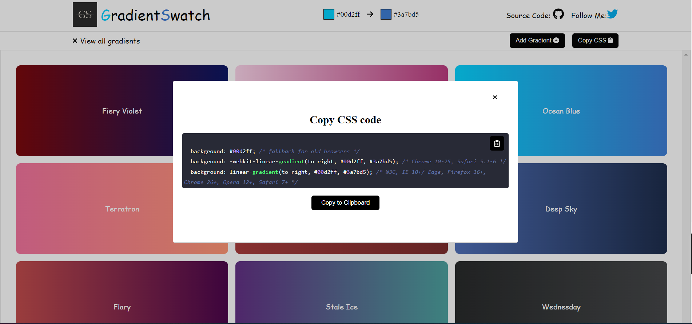

# Day 2

## A sequential background color changing gradient website. (Version 2)

### Added Features

- A beautiful page loader on a white background that shows on loading the page
- A button to add more gradients to the default gradient list
- A button to view and copy the css for the gradient website.
- A hamburger icon with this text beside it “View all gradients” containing all the gradients as cards
- A creative name for each gradient card in the "View all"

### Preview

[Live Link](http://vermilion4.github.io/gradient_website)

### How to run locally

- Clone the repo into your local machine
- cd into the folder (gradient_website) -[cd gradient_website]
- Run 'npm install' in your terminal to install all dependencies
- Run 'npm start' to start the server
- Have fun 🥳
